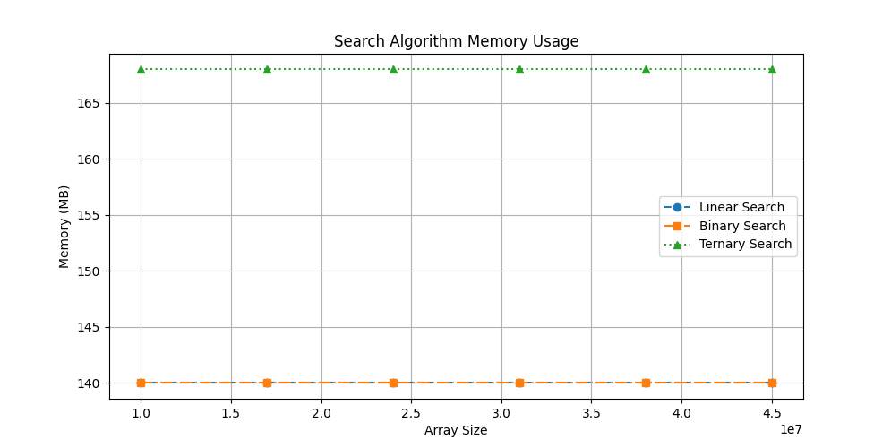
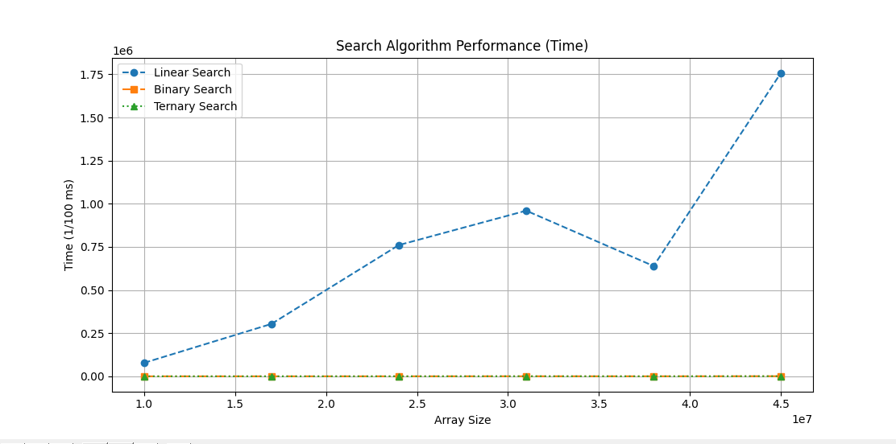
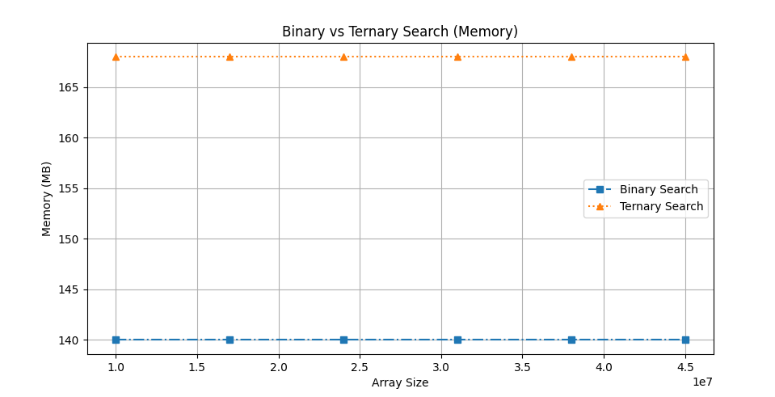
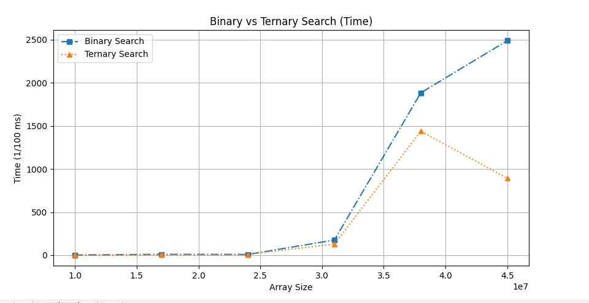
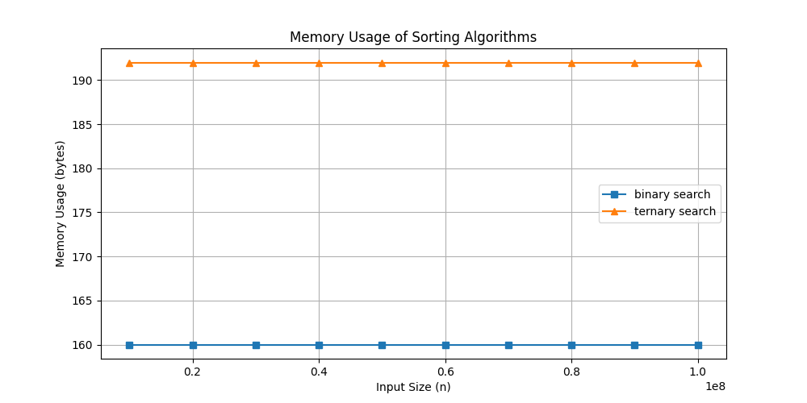
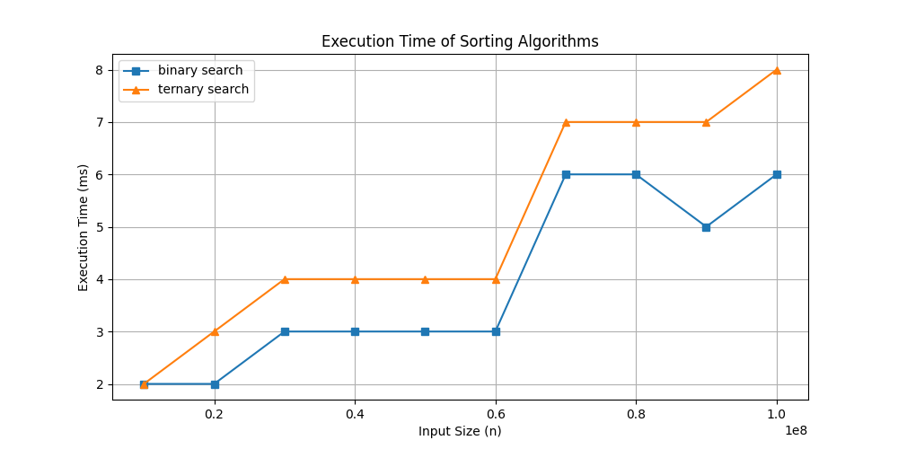
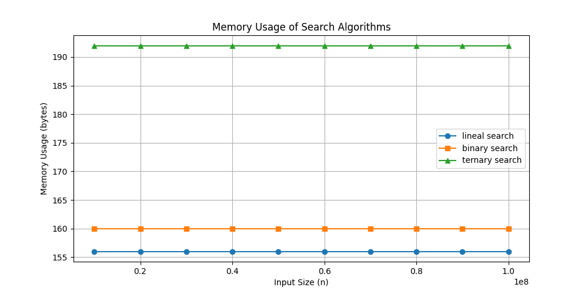
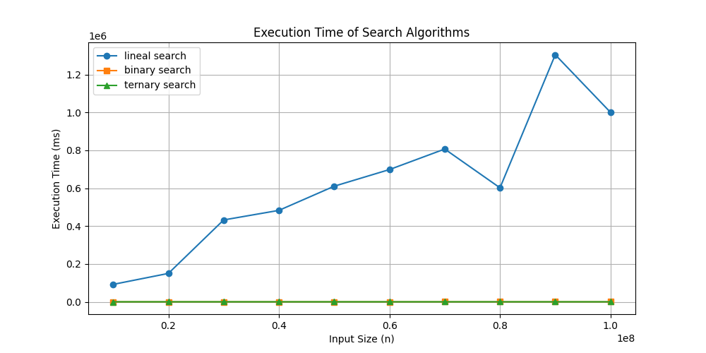

## Searching Algorithms
### Introduction
Searching algorithms are fundamental in computer science, enabling quick data retrieval and analysis. Choosing the appropriate searching technique can optimize performance and resource usage. This document explores three widely used searching methods: Linear Search, Binary Search, and Ternary Search. We will discuss their mechanisms, efficiency, and ideal use cases.

### 1. Linear Search
#### Description
Linear Search is a straightforward method of searching where each element in the list is checked one by one until the target element is found or the list ends.

#### Algorithm Steps
1. Start from the beginning of the list.
2. Compare the target element with the current element.
3. If they match, return the position.
4. If not, move to the next element.
5. Repeat until the end of the list.
6. If the target is not found, return an indication of failure.

### 2. Binary Search
#### Description
Binary Search is an efficient searching algorithm applied to sorted arrays. It works by repeatedly dividing the search interval in half.

#### Algorithm Steps
1. Determine the middle element of the list.
2. If it matches the target, return its position.
3. If the target is smaller, focus on the left subarray.
4. If the target is larger, focus on the right subarray.
5. Repeat steps 1-4 until the target is found or the interval is empty.

### 3. Ternary Search
#### Description
Ternary Search is a divide-and-conquer algorithm similar to Binary Search, but it divides the list into three parts instead of two.

#### Algorithm Steps
1. Find two midpoints dividing the list into three segments.
2. If either midpoint matches the target, return its position.
3. If the target is smaller, search the left segment.
4. If the target is between the midpoints, search the middle segment.
5. If the target is larger, search the right segment.
6. Repeat until the target is found or the segment is empty.

### Complexities
| Algorithm       | Best Case | Worst Case | Average Case |
|-----------------|-----------|------------|--------------|
| Linear Search   | O(1)      | O(n)       | O(n)         |
| Binary Search   | O(1)      | O(log₂ n)  | O(log₂ n)    |
| Ternary Search  | O(1)      | O(log₃ n)  | O(log₃ n)    |


## Coverage

Make sure you have "coverage" in your requirements.txt file and run pip install. Then run `python -m coverage run -m unittest discover` and after that run `python -m coverage report` to get the following table:
```
Name                          Stmts   Miss  Cover
-------------------------------------------------
array_search\algorithms.py       36      2    94%
data\constants.py                 2      0   100%
data\data_generator.py            6      1    83%
test\test_algorithms.py          20      1    95%
test\test_data_generator.py      29      1    97%
-------------------------------------------------
TOTAL                            93      5    95%
```

If you want to see the lines that are not being used you can run 'python -m cover html' and then 'start htmlcov\index.html'
---
# Search Algorithm Comparison

## Table 1: Comparison of Linear, Binary, and Ternary Search

| Size      | Linear Search (Time, Mem) | Binary Search (Time, Mem) | Ternary Search (Time, Mem) |
|-----------|---------------------------|---------------------------|---------------------------|
| 10,000,000  | [77,905, 140]  | [5, 140]    | [6, 168]    |
| 17,000,000  | [303,747, 140] | [16, 140]   | [59, 168]   |
| 24,000,000  | [760,657, 140] | [102, 140]  | [108, 168]  |
| 31,000,000  | [960,082, 140] | [317, 140]  | [403, 168]  |
| 38,000,000  | [639,279, 140] | [164, 140]  | [109, 168]  |
| 45,000,000  | [1,759,064, 140] | [748, 140] | [650, 168]  |

---
### Memory Usage


### Execution Time


## Table 2: Comparison of Binary and Ternary Search

| Size      | Binary Search (Time, Mem) | Ternary Search (Time, Mem) |
|-----------|---------------------------|---------------------------|
| 10,000,000  | [3, 140]    | [4, 168]    |
| 17,000,000  | [10, 140]   | [9, 168]    |
| 24,000,000  | [9, 140]    | [10, 168]   |
| 31,000,000  | [176, 140]  | [129, 168]  |
| 38,000,000  | [1,884, 140] | [1,438, 168] |
| 45,000,000  | [2,488, 140] | [892, 168]  |

---
### Memory Usage


### Execution Time


# Search Algorithm Comparison 2
## Table 1: Comparison of Linear, Binary, and Ternary Search between 10M - 100M size of arrays
Size | lineal search (Time, Mem) | binary search (Time, Mem) | ternary search (Time, Mem)
10000000 | [92007, 156] | [2, 160] | [2, 192]
20000000 | [149990, 156] | [2, 160] | [3, 192]
30000000 | [432263, 156] | [2, 160] | [3, 192]
40000000 | [482886, 156] | [2, 160] | [3, 192]
50000000 | [610437, 156] | [2, 160] | [3, 192]
60000000 | [698339, 156] | [2, 160] | [3, 192]
70000000 | [806653, 156] | [3, 160] | [4, 192]
80000000 | [601958, 156] | [4, 160] | [5, 192]
90000000 | [1304798, 156] | [4, 160] | [5, 192]
100000000 | [1000406, 156] | [3, 160] | [6, 192]

### Memory Usage


### Execution Time


## Table 2: Comparison of Binary and Ternary Search between 10 - 100M size of arrays
Size | binary search (Time, Mem) | ternary search (Time, Mem)
10000000 | [2, 160] | [2, 192]
20000000 | [2, 160] | [3, 192]
30000000 | [3, 160] | [4, 192]
40000000 | [3, 160] | [4, 192]
50000000 | [3, 160] | [4, 192]
60000000 | [3, 160] | [4, 192]
70000000 | [6, 160] | [7, 192]
80000000 | [6, 160] | [7, 192]
90000000 | [5, 160] | [7, 192]
100000000 | [6, 160] | [8, 192]


### Memory Usage


### Execution Time
